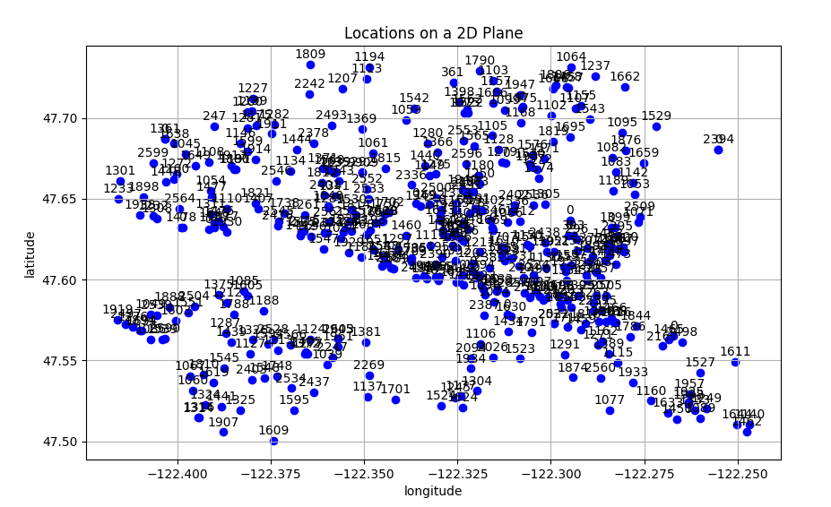
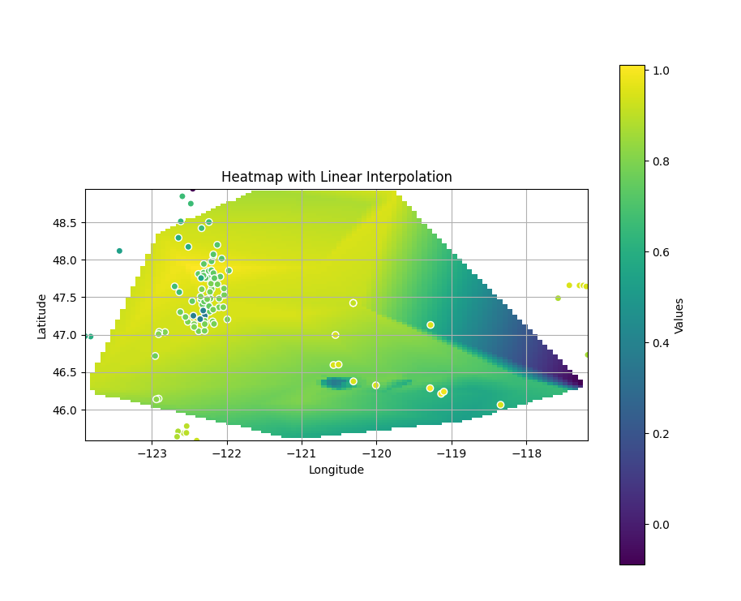
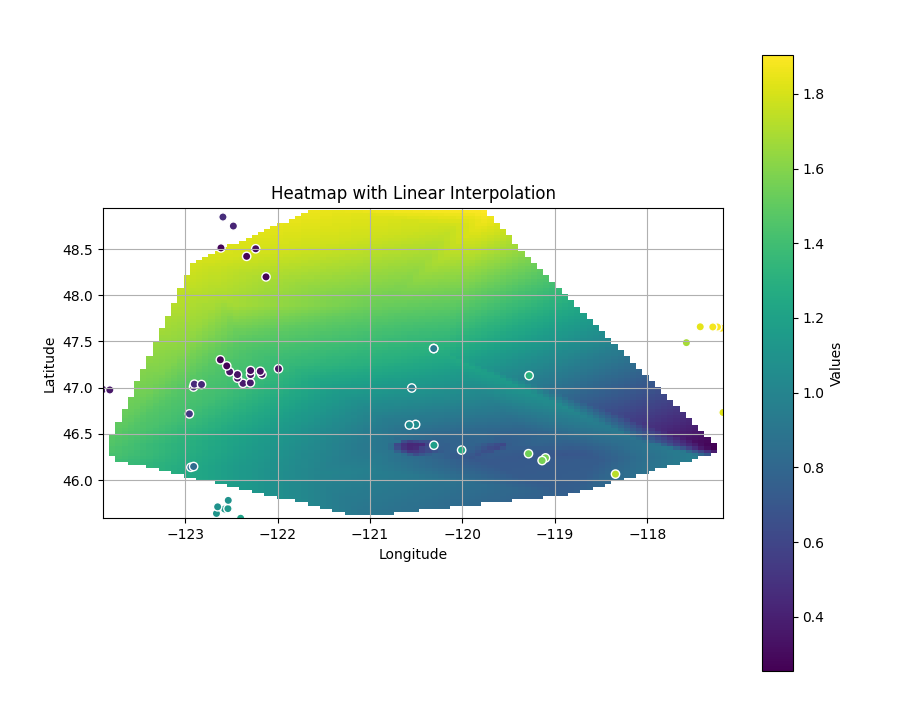
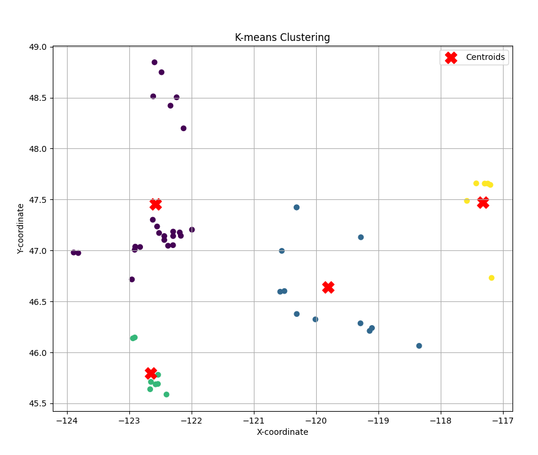

# ClimateResiliencyHack
* event page: https://climateresiliencyhack.sites.northeastern.edu/topic-1/ 

## Introduction
With climate change driving increasingly frequent and intense heat waves, communities worldwide face escalating public health risks and infrastructure challenges. Our project, Heat Wave Prediction and Cooling Resource Planning, aims to address this critical issue by using a predictive model that forecasts heat waves and identifies optimal locations for cooling resources. With historical climate data and advanced prediction models, we identify areas vulnerable to heat wave and run spatial analysis to strategically plan and allocate cooling facilities, ensuring they are accessible to the most vulnerable populations. By empowering local governments and organizations with reliable predictive insights and resource planning tools, we strive to enhance community resilience, protect public health, and contribute to sustainable urban planning in the face of a warming climate.

## Highlights
* Use a web crawler to obtain day-to-day history weather data. In this project, we obtained data in summer season (from June to September), from year 2020 to 2024.
* Predict the future locations possibly vulnerable to heat wave
* Designed an index to identify areas with higher vulnerability to heat wave and lower chance of access to public cooling spaces (for example, parks and shading)
* Use K-means to find the optimal places where public cooling facilities can be set up for nearby communities to use when heat waves hit.

## Architecture
* `get_webpage.py`: crawls data from webpage and dump into csv file
* `get_cooling_spaces`: identify areas of interest and run k-means to obtain optimal places for setting up cooling infrastructures and visualize the result
* `dates.py` and `locations.py`: dates and locations configuration file

## Results
* Existing public infrastructures: e.g. parks

* prediction of future heatwave spots

* use index to identify areas with greater vulnerability to heat wave

* optimal locations to set up infrastructure found with k means:

* community engagement plan: https://docs.google.com/document/d/1zCie1t-SU6o-xzdooB0ed9DhXAtJ9NZnVpYj3rEjzoo/edit?tab=t.frshlejt29tw#heading=h.ybzuurlhanvn

## Future Work
* include demographic data in the model to include underrepresented communities in need of more resources

## Acknowledgement
* History Weather Data Source: https://www.almanac.com
* Meta Prophet Project: https://facebook.github.io/prophet/
